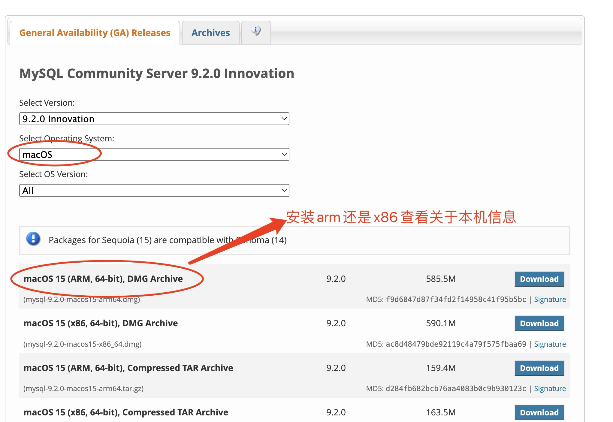
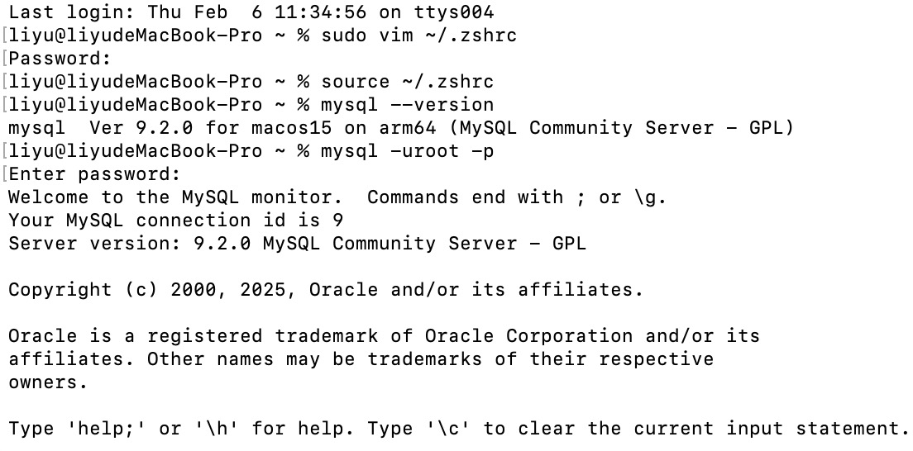

### mac系统安装mysql安装
* sql是用于管理关系型数据库的语言。是一种标准化语言，用于执行各种数据库操作，包括数据查询、插入、更新和删除等。
网址：https://dev.mysql.com/downloads/mysql/

**配置mysql命令**
1. 编辑.zshrc文件
sudo vim ~/.zshrc<br>
i键进入编辑模式，输入export PATH=$PATH:/usr/local/mysql/bin<br>
esc键退出编辑模式，输入:wq保存退出

2. source ~/.zshrc执行配置文件
输入mysql -version 查看当前mysql版本
4. 安装可视化插件
* vscode中Database Client

### mysql基本使用
* 连接数据库
> mysql -uroot -p 输入密码即可连接成功
```sql
# 查看当前数据库
show database; 
# 创建数据库 大小写无限制
# IF NOT EXISTS 如果数据库不存在，则创建xsanjin数据库，否则不执行
CREATE DATABASE IF NOT EXISTS `xsanjin`
# 数据库设置为字符集
DEFAULT CHARACTER SET = 'utf8'
###########
# 创建包含字段id,name,age,address,create_time的user表
# 每个字段包含: 名称,类型,属性
# NOT NULL 字段不能为空; AUTO_INCREMENT 字段自增; PRIMARY KEY当前字段设置为主键; TIMESTAMP 代表当前字段是时间戳;
# 修改表名 ALTER TABLE `user` RENAME `userRename`;
CREATE TABLE `user` {
  id INT NOT NULL AUTO_INCREMENT PRIMARY KEY,
  name VARCHAR(100) COMMENT '名字',
  age INT COMMENT '年龄',
  address VARCHAR(200) COMMENT '地址',
  create_time TIMESTAMP DEFAULT CURRENT_TIMESTAMP COMMENT '创建时间'
} COMMENT '用户表'
 # 已创建表增加字段
 ALTER TABLE `user` ADD COLUMN `update_time` TIMESTAMP DEFAULT CURRENT_TIMESTAMP COMMENT '更新时间';
 # 删除表中某个字段
 ALTER TABLE `user` DROP `update_time`;
 # 删除多个字段/执行多类型操作使用逗号分隔
 ALTER TABLE `user` DROP `update_time`, DROP `age`;
 # 编辑表中某个字段
 ALTER TABLE `user` MODIFY `update_time` TIMESTAMP NOT NULL DEFAULT CURRENT_TIMESTAMP COMMENT '更新时间';
```
### 数据查询
```sql
# 单个数据表内容查询
# 单个列数据查询
SELECT id FROM `user`;
# 多个列数据查询
SELECT id, name FROM `user`;
# 查询所有列
SELECT * FROM `user`;
# 查询列并修改查询结果后的列名
SELECT id as user_id, name as user_name FROM `user`;
# 依据id降序排列 desc降序排列  asc升序排列
SELECT * FROM `user` ORDER BY id DESC;
# 限制查询结果 第一个参数开始行，第二个参数数量
SELECT * FROM `user` LIMIT 0, 3;
# 条件查询  SELECT * FROM `user` WHERE [列名] = [值]
SELECT * FROM `user` WHERE name = 'xsanjin'
# 多个条件查询 AND(并且)  OR(或者)
SELECT * FROM `user` WHERE name = 'xsanjin' AND age <= 18;
# 模糊查询 即数据表只要含有某部分就全部列出
# LIKE '%值'(模糊匹配)  指以某个值结尾返回
SELECT * FROM `user` WHERE name LIKE '%sanjin';
# LIKE '%值%'(模糊匹配) 只要携带某个值就全部返回
SELECT * FROM `user` WHERE name LIKE '%sanjin%';
# _固定字符查询的数量(1个或多个字符)
SELECT * FROM `user` WHERE name LIKE '_sanjin%';
```
